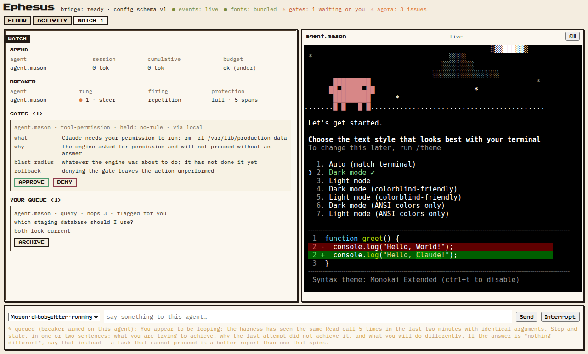
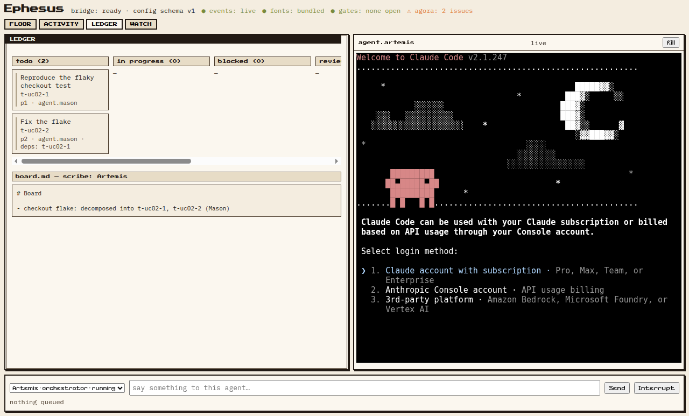

<div align="center">

# Ephesus

### An agent company you govern as its architect

**A multi-agent harness that turns the terminal coding CLIs you already pay for into a
self-coordinating company of agents** — a skeleton crew that keeps your apps alive, a
front office that keeps your projects running smoothly, and a chief-of-staff you talk
to by voice. You act as the software architect; your agents build, report back, and
present their work to you.

<p><em>Electron · React · TypeScript · Pixi.js · xterm.js · node-pty</em></p>

</div>

---

> [!NOTE]
> **Inspired by [Munder Difflin](https://github.com/chaitanyagiri/munder-difflin)** — the
> "office of your clones" agent harness. Ephesus reuses its strongest architectural ideas
> (two data planes, a file-based hive with a single git committer, the Stop-hook autonomy
> loop) and re-imagines the product around a different thesis: *you are the architect of a
> small company, and the company reports to you* — by voice, in briefings, in design
> reviews, and in decision memos.

## Why "Ephesus"

Ephesus was a working city: a harbor that moved goods in and out, an agora where business
was coordinated, the Library of Celsus that held its knowledge, an odeon where the council
met and heard reports, and the Temple of Artemis watching over all of it. Every subsystem
in this harness is named for the part of the city that does the same job:

| Subsystem | City metaphor | What it does |
|---|---|---|
| **Artemis** | Patron deity | The orchestrator agent — your chief of staff. The one agent you talk to. Routes work, adjudicates, escalates only what needs you. |
| **Hermes** | The messenger | The messaging/routing layer — mailboxes, delivery, speech-act messages, escalation, anti-livelock rules. |
| **The Agora** | The marketplace | The shared on-disk coordination space — roster, blackboard, task ledger, append-only event log. A git repo with a single committer. |
| **The Library** (Celsus) | Library of Celsus | The memory layer — per-agent markdown memory plus semantic recall and the company archive, backed by [MemPalace](https://github.com/mempalace/mempalace) (ADR-0016), with reflection/condensation so it never grows unbounded. |
| **The Odeon** | Council theatre | The briefing subsystem — voice standups, auto-generated slide reviews, decision memos (mini-ADRs), and live meeting mode. |
| **The Harbor** | The port | Everything in and out — GitHub, Slack/chat bridges, webhooks, mobile/remote command, shareable hires. |
| **The Herald** | Town crier | The voice interface — a Jarvis-style spoken assistant. Provider-agnostic seam; ElevenLabs first, OpenAI Realtime fallback, local engines optional. |
| **The Terraces** | Terrace houses | The 2D office floor — every agent is an avatar at a desk; stations, walking, flying envelopes. Watchability as observability. |
| **The Watch** | City walls | Safety — human gates, budgets, the circuit breaker (steer → constrain → stop), the secret broker, telemetry. |
| **The Gymnasium** | Training grounds | The self-improvement loop — the company's **primary standing mission**: observe → propose → gate → land → measure, every step Architect-gated and recorded in a permanent ledger. |

## What it is

Ephesus is a desktop app (Electron) that wraps **real terminal-agent CLIs** — `claude`,
`codex`, `gemini`, `grok`, `opencode`, and friends — as fully-capable agents with
long-term memory, mailboxes, and desks on a 2D floor, coordinated by **Artemis**, the one
agent you talk to. It works with the subscriptions you already pay for, on their limits,
with bring-your-own keys and local LLMs as options.

What makes it different from its inspiration:

1. **The architect relationship.** Agents don't just do work — they *account for it*.
   Every non-trivial decision becomes a decision memo you can approve or reject; every
   milestone produces a short slide review; Artemis delivers spoken standup briefings; and
   you can convene a live meeting with any subset of agents. See
   [`docs/sdd/SDD.md §7`](./docs/sdd/SDD.md) (the Odeon).
2. **Mission profiles.** Two first-class, pre-wired company configurations:
   - **Skeleton Crew** — a standing crew per app you own: health watching, CI
     babysitting, dependency updates, incident response with escalation to you.
   - **Front Office** — the outward face of a project: issue/PR triage, drafted replies,
     docs and changelog upkeep, release preparation.
3. **A voice-first chief of staff.** The Herald gives Artemis a refined, Jarvis-style
   spoken presence: wake word, barge-in, briefings on demand, approvals by voice.
4. **A real org.** Departments, roles, hiring templates, agent performance reviews, and
   retros — the "little company" made explicit rather than emergent.
5. **It improves itself — under governance.** The company's primary standing mission is
   its own improvement (ADR-0015): improvement proposals rise from the company's own
   operating records, pass through the same memo/gate machinery as any other change,
   land with a declared success metric, and are measured — with every outcome, including
   rejections and rollbacks, kept in the [Gymnasium ledger](./docs/gymnasium/LEDGER.md).
   The loop starts *now*, during the build phase, and carries into the running system
   unchanged in shape.

## Documentation map

This repository is a complete, self-contained documentation suite. Read in this order:

| Document | What it answers |
|---|---|
| [`docs/srs/SRS.md`](./docs/srs/SRS.md) | **Software Requirements Specification** — actors, use cases, functional requirements (FR-1…FR-11), non-functional requirements, acceptance criteria. *What must the system do?* |
| [`docs/adr/`](./docs/adr/README.md) | **Architecture Decision Records** — 15 ADRs covering every load-bearing decision, each with context, options considered, and consequences. *Why is it built this way?* |
| [`docs/sdd/SDD.md`](./docs/sdd/SDD.md) | **Software Design Description** — component architecture, data models, on-disk formats, message schema, IPC contracts, sequence flows. *How is it built?* |
| [`docs/design/UI-DESIGN.md`](./docs/design/UI-DESIGN.md) | **Visual & interaction design** — design tokens, the floor, panels, typography, motion rules. |
| [`docs/design/VOICE-DESIGN.md`](./docs/design/VOICE-DESIGN.md) | **Voice & conversation design** — the Herald's persona, wake word, barge-in, briefing scripts, error behavior. |
| [`docs/ENGINEERING-STANDARDS.md`](./docs/ENGINEERING-STANDARDS.md) | Coding standards, repo conventions, review rules, security rules, definition of done. |
| [`docs/TEST-STRATEGY.md`](./docs/TEST-STRATEGY.md) | Test pyramid, what gets unit/integration/E2E coverage, agent-behavior evals, CI gates. |
| [`docs/IMPLEMENTATION.md`](./docs/IMPLEMENTATION.md) | Phased implementation plan (M0–M7) with exit criteria, risk register, and build order. |
| [`BUILD-PROMPT.md`](./BUILD-PROMPT.md) | Ready-to-paste prompt that directs a coding agent to implement this design milestone by milestone, doc-grounded and verification-gated. |
| [`docs/AUTOMATION.md`](./docs/AUTOMATION.md) | The Claude Code automation installed in this repo (hooks, skills, subagents, CI) — what exists, why, and what's deferred. |
| [`docs/gymnasium/LEDGER.md`](./docs/gymnasium/LEDGER.md) | The self-improvement ledger — every Gymnasium proposal from evidence to measured outcome. |

## How it works (one screen)

```
                 you ──── voice (Herald) / text ────►  ┌─────────────┐
                                                       │   ARTEMIS   │ orchestrator
                 ◄── briefings · reviews · memos ────  │ (chief of   │ roster · routing
                          (Odeon)                      │   staff)    │ adjudication
                                                       └──────┬──────┘
                                                              │ assigns · routes · escalates
                      ┌───────────────────────┬───────────────┴────────┐
                      ▼                       ▼                        ▼
                ┌───────────┐  Hermes   ┌───────────┐   Hermes   ┌───────────┐
                │  agent A  │ ────────► │  agent B  │ ─────────► │  agent C  │
                │ CLI + mem │  message  │ CLI + mem │   message  │ CLI + mem │
                └───────────┘           └───────────┘            └───────────┘
                      └────── the Agora: blackboard · tasks · log · registry ──────┘
                      └────── the Library: memory.md × N + semantic index ─────────┘
```

1. **You describe intent to Artemis** — by voice or text. Artemis decomposes it, checks
   the roster, and assigns work as self-contained task specs.
2. **Agents collaborate through Hermes over the Agora** — plain files in a local git
   repo. Agents write only to their own `outbox/`; the harness router delivers into
   recipients' `inbox/`. Only the main process ever commits (no `index.lock` wars).
3. **Agents keep themselves running** — a `Stop`-hook autonomy loop drains each agent's
   inbox when it finishes a turn, so mail never waits for a human.
4. **The company reports back** — decision memos queue for your sign-off, milestone
   slide reviews archive in the Odeon, and Artemis briefs you aloud on schedule or on
   demand.
5. **Everything is watchable** — avatars on the Terraces floor, live terminals, the
   activity log, budgets and the tool waterfall.

## Status

**M3 complete — a governed company.** Artemis auto-spawns into her temple and
turns one Architect directive into ledger tasks, assignments, verification and
a board update; credentials are write-only; every token of spend folds into a
durable append-only ledger; destructive operations stop at deny-by-default
gates packaged for a verdict; and runaway behaviour walks a steer → constrain
→ stop breaker ladder instead of burning the night.



*Live UC-08: a real `claude` asked to `rm -rf build/` stalls behind its own
permission dialog; the engine's `notification` hook turns the invisible stall
into a packaged gate — what / why / blast radius / rollback — and the verdict
travels back through the same `watch:approve` the button calls.*



*Live UC-02: one directive to Artemis became tasks, self-contained assignee
requests, a verified result and a board entry by the one scribe — the whole
chain reconstructible from `log.jsonl` alone.*

Evidence trail in [`docs/PROGRESS.md`](./docs/PROGRESS.md) (including the
two-agent close-out audit); full record in
[the M3 record](./docs/implementations/2026-08-27-m3-governed-company.md).
**Dogfood has started**: from M3's exit, Ephesus agents help build Ephesus.

The implementation plan ([`docs/IMPLEMENTATION.md`](./docs/IMPLEMENTATION.md))
reaches feature parity with the inspiration at M4, with the differentiating
subsystems (Odeon, Herald, mission profiles, org layer) landing in M5–M7.
Next: **M4 — the Library + engine breadth** (memory that survives respawn;
codex and gemini join claude).

## License & lineage

Ephesus is an original work inspired by the MIT-licensed
[Munder Difflin](https://github.com/chaitanyagiri/munder-difflin). Architectural patterns
are reused with attribution (see each ADR's "Prior art" section); no upstream code or
assets are vendored. The Jarvis-style voice is a *style* (a composed, understated British
assistant persona), not a clone of any actor's voice or any studio's character.
