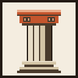
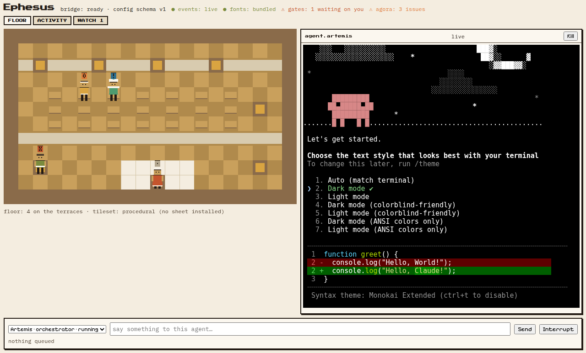

<div align="center">



# Ephesus

### An agent company you govern as its architect

**A multi-agent harness that turns the terminal coding CLIs you already pay for into a
self-coordinating company of agents** — a skeleton crew that keeps your apps alive, a
front office that keeps your projects running smoothly, and a chief-of-staff you talk
to by voice. You act as the software architect; your agents build, report back, and
present their work to you.

<p><em>Electron · React · TypeScript · Pixi.js · xterm.js · node-pty</em></p>

[](https://github.com/mertefesensoy/Ephesus/actions/workflows/ci.yml)
[](./LICENSE)
[](#status)
[](./.nvmrc)

</div>

---



<div align="center"><sub>A development build — four agents at their desks, one live in a real terminal. The floor is drawing procedural tiles here: the licensed sprite sheets are deliberately not in this repository.</sub></div>

## Status

**Pre-alpha. There are no releases and no installer** — signed builds are a planned
milestone (M7b.5) and have not shipped. If you are here to *use* Ephesus, the honest
answer is: not yet. If you are here to *build* it, everything runs from source today
and [contributions are welcome](./CONTRIBUTING.md).

What works right now: the Electron shell, real agent CLIs under management with
memory and mailboxes, the 2D floor, the Agora, the Odeon, the Stoa and the Gymnasium
self-improvement loop. The current milestone is **M8 — the company you can leave
running**. Package-by-package state with evidence is in
[`docs/PROGRESS.md`](./docs/PROGRESS.md); the narrative is under
[Where the build stands](#where-the-build-stands).

## Quick start

You need **Node 20** ([`.nvmrc`](./.nvmrc)), a toolchain that can compile native
modules (`node-pty` and `better-sqlite3` are built on install), and at least one
agent CLI on your `PATH`.

```bash
git clone https://github.com/mertefesensoy/Ephesus.git
cd Ephesus
npm install     # patches node-pty, syncs the pixel fonts, rebuilds natives
npm run dev     # the app, with hot reload
```

Then confirm the checkout is healthy:

```bash
npm run typecheck && npm run lint && npm test
```

All three must be green on a fresh clone. If they are not, that is a bug and we want
the issue. The full story — which engine to install, the files created in
`~/.ephesus/`, and what the shipped gate policy allows — is under
[Setting it up](#setting-it-up).

## Contributing

Ephesus is documentation-first, and its rules are unusual on purpose: the docs are the
source of truth, accepted ADRs are append-only, every pull request carries evidence,
and **a wiring seam with no test is a defect rather than a gap**.
[`CONTRIBUTING.md`](./CONTRIBUTING.md) explains all of it, including exactly what you
get from a first clone and what is deliberately missing from it.

The single most useful contribution today: **clone it, run it on a machine that is not
Windows, and open an issue about the first thing that goes wrong.**

---

## Why "Ephesus"

Ephesus was a working city: a harbor that moved goods in and out, an agora where business
was coordinated, the Library of Celsus that held its knowledge, an odeon where the council
met and heard reports, and the Temple of Artemis watching over all of it. Every subsystem
in this harness is named for the part of the city that does the same job:

| Subsystem | City metaphor | What it does |
|---|---|---|
| **Artemis** | Patron deity | The orchestrator agent — your chief of staff. The one agent you talk to. Routes work, adjudicates, escalates only what needs you. |
| **Hermes** | The messenger | The messaging/routing layer — mailboxes, delivery, speech-act messages, escalation, anti-livelock rules. |
| **The Agora** | The marketplace | The shared on-disk coordination space — roster, blackboard, task ledger, append-only event log. A git repo with a single committer. |
| **The Library** (Celsus) | Library of Celsus | The memory layer — per-agent markdown memory plus semantic recall and the company archive, backed by [MemPalace](https://github.com/mempalace/mempalace) (ADR-0016), with reflection/condensation so it never grows unbounded. |
| **The Odeon** | Council theatre | The briefing subsystem — voice standups, auto-generated slide reviews, decision memos (mini-ADRs), and live meeting mode. |
| **The Harbor** | The port | Everything in and out — GitHub, Slack/chat bridges, webhooks, mobile/remote command, shareable hires. |
| **The Herald** | Town crier | The voice interface — a Jarvis-style spoken assistant. Provider-agnostic seam; ElevenLabs first, OpenAI Realtime fallback, local engines optional. |
| **The Terraces** | Terrace houses | The 2D office floor — every agent is an avatar at a desk; stations, walking, flying envelopes. Watchability as observability. |
| **The Watch** | City walls | Safety — human gates, budgets, the circuit breaker (steer → constrain → stop), the secret broker, telemetry. |
| **The Gymnasium** | Training grounds | The self-improvement loop — the company's **primary standing mission**: observe → propose → gate → land → measure, every step Architect-gated and recorded in a permanent ledger. |
| **The Stoa** | Colonnade of the scholars | The research department — studies Architect-registered external repositories (the tagged watchlist) and files provenance-cited briefs that feed the Gymnasium (ADR-0017); company modes decide when it runs autonomously, behind a proof gate (ADR-0018). |

## What it is

Ephesus is a desktop app (Electron) that wraps **real terminal-agent CLIs** — `claude`,
`codex`, `gemini`, `grok`, `opencode`, and friends — as fully-capable agents with
long-term memory, mailboxes, and desks on a 2D floor, coordinated by **Artemis**, the one
agent you talk to. It works with the subscriptions you already pay for, on their limits,
with bring-your-own keys and local LLMs as options.

What makes it different from its inspiration:

1. **The architect relationship.** Agents don't just do work — they *account for it*.
   Every non-trivial decision becomes a decision memo you can approve or reject; every
   milestone produces a short slide review; Artemis delivers spoken standup briefings; and
   you can convene a live meeting with any subset of agents. See
   [`docs/sdd/SDD.md §7`](./docs/sdd/SDD.md) (the Odeon).
2. **Mission profiles.** Three first-class, pre-wired company configurations:
   - **Skeleton Crew** — a standing crew per app you own: health watching, CI
     babysitting, dependency updates, incident response with escalation to you.
   - **Front Office** — the outward face of a project: issue/PR triage, drafted replies,
     docs and changelog upkeep, release preparation.
   - **Recursive Improvement** — the self-improvement mission as a switchable crew
     (ADR-0019): you present repositories by URL, the Stoa studies them, approved
     proposals come back as pull requests from the company's own GitHub identity
     (ADR-0020) — and you merge.
3. **A voice-first chief of staff.** The Herald gives Artemis a refined, Jarvis-style
   spoken presence: wake word, barge-in, briefings on demand, approvals by voice.
4. **A real org.** Departments, roles, hiring templates, agent performance reviews, and
   retros — the "little company" made explicit rather than emergent.
5. **It improves itself — under governance.** The company's primary standing mission is
   its own improvement (ADR-0015): improvement proposals rise from the company's own
   operating records, pass through the same memo/gate machinery as any other change,
   land with a declared success metric, and are measured — with every outcome, including
   rejections and rollbacks, kept in the [Gymnasium ledger](./docs/gymnasium/LEDGER.md).
   The loop starts *now*, during the build phase, and carries into the running system
   unchanged in shape.

## How it works (one screen)

```
                 you ──── voice (Herald) / text ────►  ┌─────────────┐
                                                       │   ARTEMIS   │ orchestrator
                 ◄── briefings · reviews · memos ────  │ (chief of   │ roster · routing
                          (Odeon)                      │   staff)    │ adjudication
                                                       └──────┬──────┘
                                                              │ assigns · routes · escalates
                      ┌───────────────────────┬───────────────┴────────┐
                      ▼                       ▼                        ▼
                ┌───────────┐  Hermes   ┌───────────┐   Hermes   ┌───────────┐
                │  agent A  │ ────────► │  agent B  │ ─────────► │  agent C  │
                │ CLI + mem │  message  │ CLI + mem │   message  │ CLI + mem │
                └───────────┘           └───────────┘            └───────────┘
                      └────── the Agora: blackboard · tasks · log · registry ──────┘
                      └────── the Library: memory.md × N + semantic index ─────────┘
```

1. **You describe intent to Artemis** — by voice or text. Artemis decomposes it, checks
   the roster, and assigns work as self-contained task specs.
2. **Agents collaborate through Hermes over the Agora** — plain files in a local git
   repo. Agents write only to their own `outbox/`; the harness router delivers into
   recipients' `inbox/`. Only the main process ever commits (no `index.lock` wars).
3. **Agents keep themselves running** — a `Stop`-hook autonomy loop drains each agent's
   inbox when it finishes a turn, so mail never waits for a human.
4. **The company reports back** — decision memos queue for your sign-off, milestone
   slide reviews archive in the Odeon, and Artemis briefs you aloud on schedule or on
   demand.
5. **Everything is watchable** — avatars on the Terraces floor, live terminals, the
   activity log, budgets and the tool waterfall.

## Setting it up

Ephesus runs a company of real terminal-agent CLIs on your machine. It needs
three things from you and creates the rest itself.

**1. The toolchain.** Node 20 (`.nvmrc`), then:

```bash
npm install        # postinstall patches node-pty and rebuilds native modules
npm run dev        # the app, with hot reload
```

**2. An engine you are logged into.** The MVP ships Claude only
([ADR-0024](./docs/adr/ADR-0024-claude-only-for-the-mvp.md)): install the
`claude` CLI and sign in.

```bash
claude auth status   # what Ephesus asks before it hires anybody
claude auth login    # if that says you are not logged in
```

Ephesus asks this itself at every spawn. An agent whose engine has no session
is shown as **needs-login** with the command to run, rather than started and
left sitting at a login prompt while its card claims it is working.

**3. Nothing else.** On first launch the harness creates `~/.ephesus/` and
writes the files it needs, then tells you it did:

| File | What it decides | If you delete it |
|---|---|---|
| `config.json` | Window bounds, company mode | Recreated with defaults |
| `gate-policy.json` | The company-wide autonomy ceiling and which classes are held for a human | Everything is held and every profile is clamped to `manual`, reported as a degradation |
| `authority.json` | What Artemis may decide without you (FR-5.5) | She decides nothing and every routine call queues for you |
| `github-app.json` | The company's GitHub identity (optional, ADR-0022) | No company identity; the activation screen says which grants the broker cannot supply |

`~/.ephesus/` is **yours**. Ephesus writes a file there only when it is absent
and never edits one you already have, so anything you change stays changed.

### What the shipped gate policy allows

The ceiling ships at `autonomous` so a profile's own declaration governs, with
every irreversible class held at `supervised` — attempted with you able to see
and stop it, never silently:

```
destructive · prod-facing · scope-change · outbound · spend    supervised
needs-human                                                    manual
everything else                                                the profile decides
```

Autonomy composes **stricter-wins**: a profile can only ever be more cautious
than this file, never less. Edit `gate-policy.json` to tighten the whole
company at once.

### Watching a repository

A mission profile is activated against a target repository from the **Profiles**
tab. The activation screen shows what would happen before anything does: which
agents get hired, what they may do, which triggers get armed, which declared
secrets the broker cannot actually supply, and **which repository it would
watch**.

You do not have to tell it which repository that is — Ephesus reads the target
checkout's git remote and says what it found and where it found it. Two cases
where it will not guess, and says so on the screen instead:

| What it finds | What it does |
|---|---|
| one GitHub remote | watches that repository |
| a fork (`origin` and `upstream` at different repositories) | refuses, names both, asks you to pick |
| no remote, or no GitHub remote | says the instance will watch nothing, and why |

In either of those, type the `owner/repo` into the repositories box before
reading the plan. Whatever the bundle's own `harbor.json` declares wins over the
checkout; what you type wins over both.

An instance that comes up watching nothing still hires its crew and arms its
schedules — but it can ingest no CI run, issue or pull request, so it will raise
no incident, and that shows up as a degradation rather than as silence.

## Documentation map

This repository is a complete, self-contained documentation suite. Read in this order:

| Document | What it answers |
|---|---|
| [`docs/srs/SRS.md`](./docs/srs/SRS.md) | **Software Requirements Specification** — actors, use cases, functional requirements (FR-1…FR-11), non-functional requirements, acceptance criteria. *What must the system do?* |
| [`docs/adr/`](./docs/adr/README.md) | **Architecture Decision Records** — 15 ADRs covering every load-bearing decision, each with context, options considered, and consequences. *Why is it built this way?* |
| [`docs/sdd/SDD.md`](./docs/sdd/SDD.md) | **Software Design Description** — component architecture, data models, on-disk formats, message schema, IPC contracts, sequence flows. *How is it built?* |
| [`docs/design/UI-DESIGN.md`](./docs/design/UI-DESIGN.md) | **Visual & interaction design** — design tokens, the floor, panels, typography, motion rules. |
| [`docs/design/VOICE-DESIGN.md`](./docs/design/VOICE-DESIGN.md) | **Voice & conversation design** — the Herald's persona, wake word, barge-in, briefing scripts, error behavior. |
| [`docs/ENGINEERING-STANDARDS.md`](./docs/ENGINEERING-STANDARDS.md) | Coding standards, repo conventions, review rules, security rules, definition of done. |
| [`docs/TEST-STRATEGY.md`](./docs/TEST-STRATEGY.md) | Test pyramid, what gets unit/integration/E2E coverage, agent-behavior evals, CI gates. |
| [`docs/IMPLEMENTATION.md`](./docs/IMPLEMENTATION.md) | Phased implementation plan (M0–M7) with exit criteria, risk register, and build order. |
| [`BUILD-PROMPT.md`](./BUILD-PROMPT.md) | Ready-to-paste prompt that directs a coding agent to implement this design milestone by milestone, doc-grounded and verification-gated. |
| [`docs/AUTOMATION.md`](./docs/AUTOMATION.md) | The Claude Code automation installed in this repo (hooks, skills, subagents, CI) — what exists, why, and what's deferred. |
| [`docs/gymnasium/LEDGER.md`](./docs/gymnasium/LEDGER.md) | The self-improvement ledger — every Gymnasium proposal from evidence to measured outcome. |
| [`docs/stoa/WATCHLIST.md`](./docs/stoa/WATCHLIST.md) | The research watchlist — the external sources the Architect has registered for study, and the briefs they produce. |

## Where the build stands

**M8 in progress — the company you can leave running.** M6 and M7 landed the
spoken company and the two outward missions; M8 is the hardening milestone that
runs before shipping, because the suite was green while Closing Time had never
once run in the shipped app, the standup read the oldest 500 log entries, and
the dock showed an overnight run's first 300 events.

Landed so far: a coverage baseline and the seam rule that enforces it (a wiring
seam with no test is a defect, not a gap); a quit path that actually runs, with
one door to the renderer and one ordered, isolated shutdown sequence; a
degradation channel where every give-up is visible, durable and countable; the
log-derived surfaces reading the whole book instead of its oldest 500 entries;
the setup cliff — the config files the harness needs are now created,
documented and reported, and an engine with no session says so instead of
pretending to work; and a mission activated against a repository now actually
watches it, because the checkout is asked which repository it is rather than a
bundle that ships an empty list being the only source of the answer.

M7's own exit (SRS §6.1 on a real repository) remains open and is independent
of M8.

---

*The previous milestone's story:*

**M5b complete — the learning company, on a licensed floor.** The Stoa is in
the product: repositories the Architect registers by URL on the **reading
desk** (tagged, licensed, pinned), a researcher plan that is read-only and
secret-free *by construction*, briefs whose every finding must cite a path at
the pinned commit or die before a human sees them, and proposals that must
cite the brief they descend from. Company modes gate autonomy: `improving`
cannot be switched on until the §6.9 proof gate reads its evidence off the
ledger, the mode is visible everywhere, and a rung-3 breaker stop on
improvement work reverts it. The floor now paints from the purchased LimeZu
packs — [see it](./docs/demo/m5b-floor-limezu.png) — with the sheets kept out
of the repo per licence and the credit on the status strip.

```
EVIDENCE registered: src-munder-difflin pin=b91a49f license=MIT
EVIDENCE plan: commit=b91a49f readOnly=true envGrants=[]
EVIDENCE brief archived: RB-001 "Closing time and the hook-return…"
EVIDENCE ledger: GYM-001 … status=proposed cites=RB-001
```

The M5b demo view is in [`docs/demo/`](./docs/demo/): the reading desk and a
brief on screen (`m5b-stoa-desk` · `m5b-stoa-brief`), the three cycle captures
(`m5b-cycle-1/2/3`), the LimeZu floor, and — from the close-out audit — the
research cycle re-run against a **real, remotely-verifiable pin**
([`m5b-cycle-real-source.txt`](./docs/demo/m5b-cycle-real-source.txt)): the
audit caught the original demo citing a commit that existed in no repository,
the record was amended, and the chain re-proven end to end. Four in-milestone
defects were found by running the demo; the audit added five more fixes, every
one with a named regression test. Evidence trail in
[`docs/PROGRESS.md`](./docs/PROGRESS.md); full record in
[the M5b record](./docs/implementations/2026-08-28-m5b-stoa-and-modes.md).

Next: **M6 — the floor's face + the Herald** (citizens at the MD-grade §5.1
spec, stations that are facts, act-colored envelope flights — then the spoken
company). The art spec landed as UI-DESIGN v2 at the M5b close.

---

*The previous milestone's story:*

**M5 complete — the accountable company.** A `review:deck` task is
*mechanically unclosable* until its deck is archived; a new dependency is held
at the choke point until a memo exists and is verdict-ed — Artemis decides
within her delegated classes and **countersigns**, everything else queues for
the Architect, and a rejection reverses the action. Briefings are compiled
facts first, narrative second: a sentence without a resolvable ref refuses the
whole brief. Meetings enforce turn order (an early answer is held, not lost)
and file their minutes; the org layer computes every metric from `log.jsonl`
alone and writes a weekly retro that decides nothing. And the Gymnasium runs
governed: proposals without a falsifiable metric never reach a human,
verdicts are Architect-only, authority-widening is refused before any
approver could say yes.

```
DEMO 1 close before the deck: todo      ← refused; the task did not move
DEMO 1 close after the deck:  done
DEMO 2 action held by: new-dependency
DEMO 2 rejection reverses the action: denied
DEMO 3 every sentence carries refs: true
DEMO 4 held (said early): [ agent.scribe ]
```

The demo view is in [`docs/demo/`](./docs/demo/): the six panel screenshots
(`m5-briefs-tab` · `m5-decks-tab` · `m5-memos-tab` · `m5-odeon-meeting` ·
`m5-org-metrics` · `m5-gymnasium`), a real archived deck
([`m5-deck-artifact.html`](./docs/demo/m5-deck-artifact.html)), and
[the retro report](./docs/demo/m5-retro-report.md) generated from this
company's own records. Alongside M5, the **Stoa** ran its first full cycle:
a research brief over the upstream inspiration ([RB-001](./docs/stoa/briefs/RB-001-munder-difflin-orchestration-autonomy.md))
became two Architect-approved, landed improvements (hook-boundary steer,
closing time) — the ledger's first proof-gate evidence. M5 was closed by the
two-agent audit (execution + design conformance); it re-proved every exit
criterion and caught one real ledger-column defect, fixed with regression
tests. Evidence trail in [`docs/PROGRESS.md`](./docs/PROGRESS.md); full
record in [the M5 record](./docs/implementations/2026-08-28-m5-accountable-company.md).

## License & lineage

Ephesus is an original work inspired by the MIT-licensed
[Munder Difflin](https://github.com/chaitanyagiri/munder-difflin). Architectural patterns
are reused with attribution (see each ADR's "Prior art" section); no upstream code or
assets are vendored. The Jarvis-style voice is a *style* (a composed, understated British
assistant persona), not a clone of any actor's voice or any studio's character.


---


> [!NOTE]
> **Inspired by [Munder Difflin](https://github.com/chaitanyagiri/munder-difflin)** — the
> "office of your clones" agent harness. Ephesus reuses its strongest architectural ideas
> (two data planes, a file-based hive with a single git committer, the Stop-hook autonomy
> loop) and re-imagines the product around a different thesis: *you are the architect of a
> small company, and the company reports to you* — by voice, in briefings, in design
> reviews, and in decision memos.


