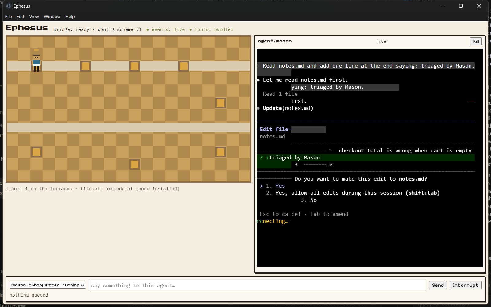
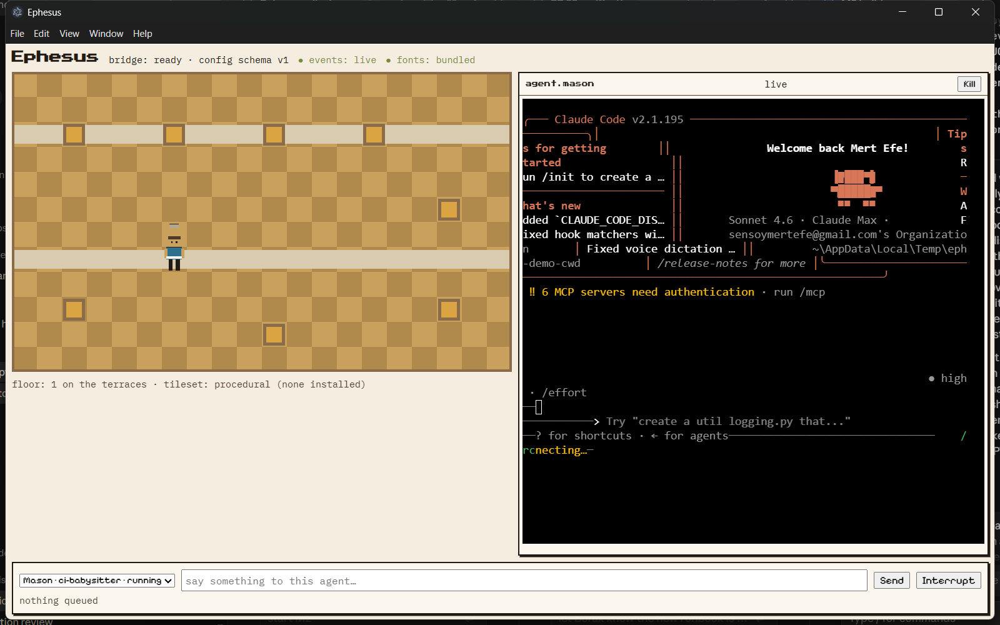

# M1 — One real agent, both planes (M1.1–M1.7 + close-out audit)

**Date:** 2026-08-26 · **Milestone:** M1 (docs/IMPLEMENTATION.md) · **Author:** the Architect (agent-assisted sessions)

## Demo view



*The SRS UC-03 vertical, live: a real `claude` (2.1.195) spawned through
`window.eph.agents.spawn`, its TUI streaming byte-for-byte into the agent
terminal (right) as it edits `notes.md` (`+triaged by Mason` in the diff, the
engine's own permission dialog untouched by the harness); on the Terraces
(left) the same event stream drove the avatar's walk from its desk to the
**shelf** — file-tool class → shelf station, SDD §6. Status strip: `events:
live`, `fonts: bundled`. Bottom: the command bar with queue-until-idle
semantics; the sequence of a mid-run prompt being HELD and then FLUSHED is
recorded in the M1 exit review (docs/PROGRESS.md).*



## Problem / Motivation

M0 proved the shell; M1 had to prove the *product mechanism*: that a real,
unmodified engine CLI can be employed as an agent — spawned from an adapter's
plan, observed through a hook event plane it cannot spoof, drawn honestly on
the floor, and driven by an Architect who can type into it mid-run — without
the harness ever becoming an agent framework (ADR-0009).

## What Changed (by package)

| Package | Files (core) | What landed |
|---|---|---|
| M1.1 Adapter surface | `src/main/engines/types.ts`, `index.ts`, `src/shared/engines.ts` | ADR-0009's `EngineAdapter` transcribed member-for-member; registry with duplicate-refusal |
| M1.2 Fake engine | `test/fakes/fake-engine/`, `shims/hook-client.mjs` | Script-driven real CLI: scripted hook POSTs, inbox/outbox, fail-open; the test double for every later milestone |
| M1.3 Hook server | `src/main/hooks.ts`, `src/shared/hooks.ts` | UDS/named-pipe endpoint (0600 / local-namespace + home-hash), per-spawn token on every payload, drift → visible warning |
| M1.4 Claude adapter | `src/main/engines/claude.ts`, `shims/eph-hook.mjs`, `src/main/agents.ts`, `prompts/` | Spawn plan (allowlist env ∪ grants ∪ EPH_*), settings.local.json wiring with byte-for-byte backup/uninstall, identity injection, FR-1.6 install offer, spawn lifecycle with clean unwind |
| M1.5 Avatar machine | `src/shared/avatar.ts`, `src/main/avatars.ts` | SDD §6 as a pure reducer — all ten states, timers, station map; undocumented edges inert; events-stale/drift surfaces |
| M1.5b Floor art v1 | `src/renderer/src/floor/citizen.ts`, `assets/ATTRIBUTION.md`, `fonts.ts` | §7-bar procedural citizens (8 dir × 4 frames, ≤5 colors, 5 silhouettes), licence-compliant tileset + font intake paths with visible missing-states |
| M1.6 Command bar | `src/main/commands.ts`, `src/renderer/src/CommandBar.tsx` | FR-1.3 queue-until-idle in main (renderer is a projection), two-write submit, interrupt |
| M1.7 Conformance | `test/conformance/` | 13-case table × (fake, claude) + 6 behavioral cases; the grade-honesty check provably catches a dishonest adapter |

## Implementation Approach

Two planes, one truth: the PTY plane carries authentic bytes (the terminal is
sacred — the engine's own TUI, dialogs included), while the event plane carries
schema'd envelopes from a shim the harness installs into the *agent's* cwd
settings — token-gated per spawn, fail-open so a dead harness never breaks an
agent. Everything renderer-visible is a projection of main-validated state;
everything the harness writes into an agent's world (settings, identity,
protocol) is inspectable, backed up, and restored on unwind. The avatar
machine is a pure reducer over event-plane facts — the floor can only show
what actually happened.

## Mathematical / Statistical Details

None beyond M0's walk quantization. The only ordering-sensitive mechanism is
the command queue's two-write submit (text, then submit key after a measured
delay — a TUI in bracketed-paste mode otherwise swallows the trailing CR).

## Design Decisions

Logged per-package in `docs/DECISIONS-LOG.md` (M1.1–M1.7 entries): adapter
surface placement vs the boundary lint, dependency-free `.mjs` shims with
`checkJs`, the hook envelope landing with its validator ahead of the server,
pipe-name hashing for parallel homes, synchronous spawn-id claim (a real race
found live), and the separate-writes submit. The close-out audit added three:
the FR-1.6 installer env fix, gate-verdict station restore, and the
secret-shaped fixture rename.

## Verification

```
npm run typecheck && npm run lint && npm test     # 375 passed / 3 skipped
npx vitest run test/conformance --reporter=verbose # 32/32, both adapters
```

M1 exit review (docs/PROGRESS.md): UC-03 run live against `claude 2.1.195`
end-to-end, with the mid-run queue/flush proven on disk. Close-out audit:
spec-verifier re-ran every per-PR criterion by execution (10/10 PASS, exact
counts reproduced, fake engine live over a real named pipe, boundaries bite,
settings hygiene proven against `~/.claude` mtimes); doc-guardian conformance
review: conforms — its findings were fixed at close (installer env, verdict
station restore, fixture rename) with a named regression test each where code
changed. CI green on every M1 commit (runs 32997376748 → 33008183972).

## Related Docs

`docs/PROGRESS.md` (M1 evidence + exit review) · ADR-0009 · SDD §3, §5, §6 ·
`docs/TEST-STRATEGY.md` §1.2, §5 · UI-DESIGN §7 · `docs/DECISIONS-LOG.md`
